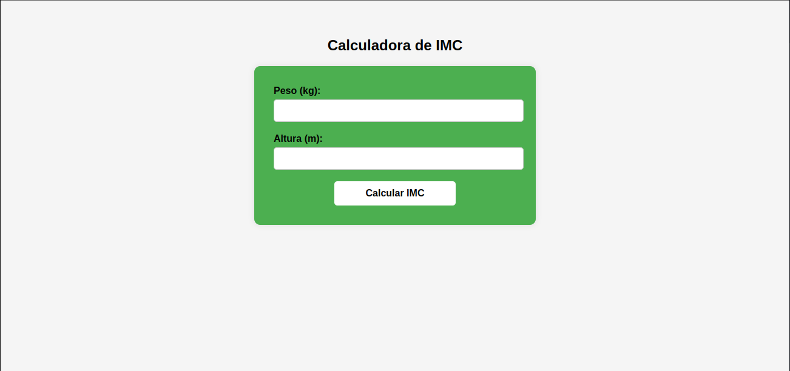

# 🧮 Calculadora de Índice de Massa Corporal (IMC)

Este projeto contém dois exemplos em PHP para cálculo do IMC, desenvolvidos como exercícios acadêmicos. Ambos são executados via terminal (CLI).

## 📁 Arquivos

- `calculo_imc.php` → Versão simples com valor fixo
- `calculoimc.php` → Versão interativa, recebe peso e altura via terminal

## 🛠 Tecnologias Utilizadas

- PHP (executado via terminal/CLI)

💡 Lógica da Classificação IMC 

Faixa de IMC	Classificação
Até 18.5 -> Magreza
18.51 a 24.9 -> Saudável
25.0 a 29.9	-> Sobrepeso
30.0 a 34.9	-> Obesidade Grau I
35.0 a 39.9	-> Obesidade Grau II
Acima de 40	-> Obesidade Grau III

## 📷 Visual do Projeto

### Página Inicial

### Resultado do IMC

Projeto desenvolvido por Leonardo Martins 🎓